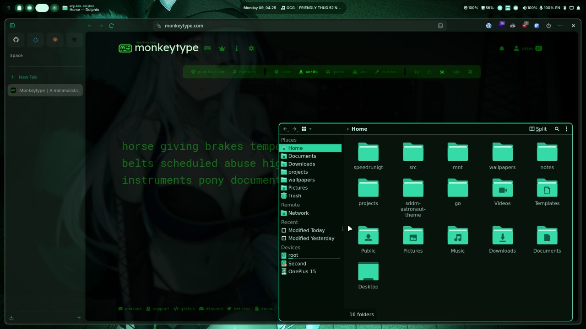
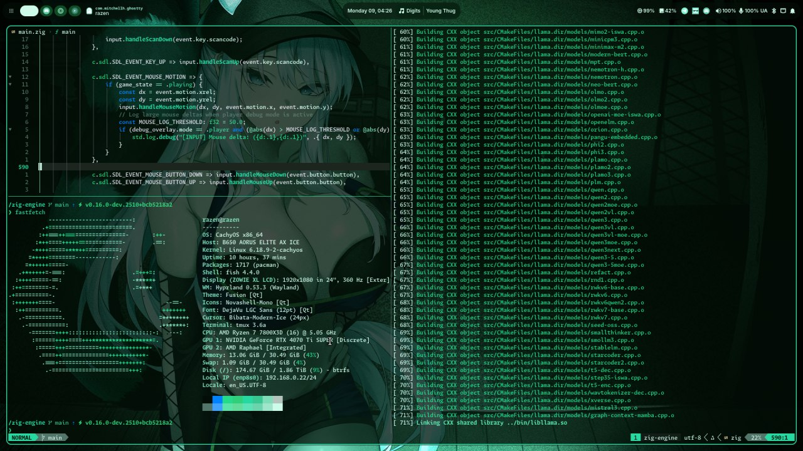
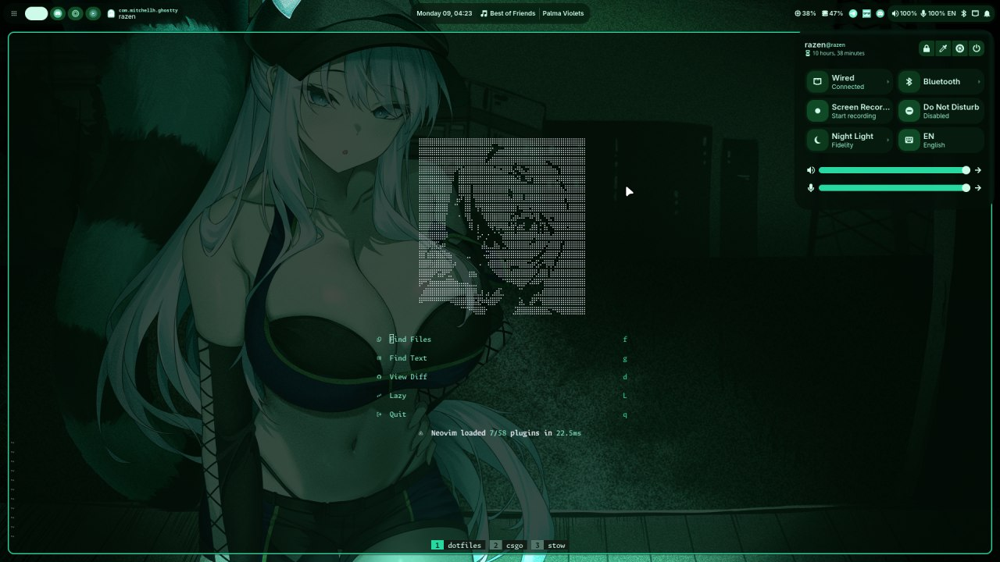
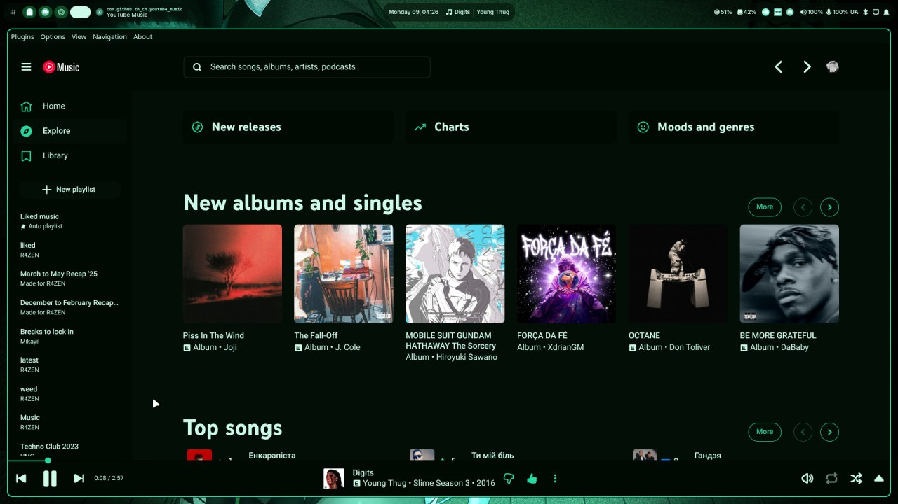

# Novashell

TypeScript shell layer for Hyprland, built with AGS + Astal.

## Preview

| Desktop                           | Terminal                            | Neovim                                  |
| --------------------------------- | ----------------------------------- | --------------------------------------- |
|  |  |    |

| Telegram                            | Discord                           | YouTube Music                             |
| ----------------------------------- | --------------------------------- | ----------------------------------------- |
|  |  |   |

> Live wallpaper-driven theming propagated across the desktop, terminal, editor, and apps.

## What it covers

| Area          | Included                                                                                          |
| ------------- | ------------------------------------------------------------------------------------------------- |
| Shell windows | Bar, control center, apps window, runner, center window, OSD, floating notifications, logout menu |
| CLI           | `nsh` (full output/help/build), `nsh-msg` (fast socket actions)                                   |
| Runner        | Plugin-based launcher with app/shell/media/theme/wallpaper/clipboard/search utilities             |
| Theming       | Dynamic wallpaper-driven palette + static bundled themes                                          |

## Runner plugins

| Prefix   | Plugin     | Purpose                                                |
| -------- | ---------- | ------------------------------------------------------ |
| _(none)_ | Apps       | App launcher with usage-aware sorting                  |
| `!`      | Shell      | Run shell commands (`!!` can show output notification) |
| `?`      | Web search | Search directly in browser                             |
| `:k`     | Kill       | Trigger Hyprland client kill mode                      |
| `:`      | Media      | Play/pause/next/prev actions                           |
| `#`      | Wallpapers | Browse/set wallpapers                                  |
| `>`      | Clipboard  | Search/select clipboard history                        |
| `@`      | Themes     | Switch shell/app color themes                          |
| `~`      | Colors     | Convert between color formats                          |

## Theme and wallpaper system

- `pywal` mode regenerates colors from the active wallpaper.
- Static bundled themes: `catppuccin-mocha`, `everforest`, `gruvbox`, `nord`, `rose-pine`, `tokyo-night`.
- Color updates are propagated to terminal/editor/desktop apps (Ghostty, Fish, Neovim, tmux, GTK/Qt/KDE, Telegram, Vesktop, YouTube Music, Zen, btop, Hyprland).
- `wallpaper set` respects theme sync rules; `wallpaper set-only` changes wallpaper without recoloring everything.

## CLI quick usage

```sh
# shell windows
nsh toggle control-center
nsh runner

# media / volume
nsh media play-pause
nsh volume sink-set 35

# theme / wallpaper
nsh theme list
nsh theme set pywal
nsh wallpaper set ~/wallpapers/example.jpg
```

Use `nsh-msg` for low-latency action commands when no output is needed.

## Build and install

```sh
cd novashell
pnpm install
pnpm build
```

Symlink the build outputs into your `PATH`, e.g. `~/.local/bin` (`novashell`, `nsh`).

## Scope

- Runtime config: `~/.config/novashell/config.json`
- Hyprland is the currently implemented backend.
- A compositor abstraction exists, but non-Hyprland backends are not production-ready yet.
